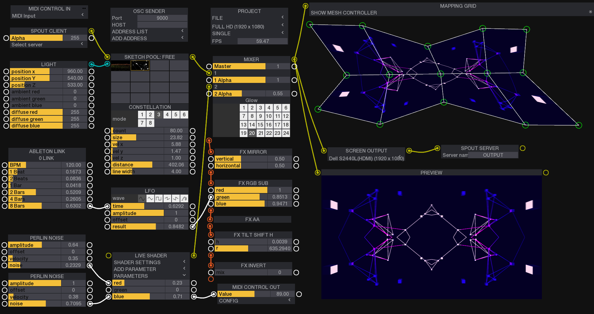

## ofxDarkKnight ##


**Node based programming environment for openframeworks**


# Getting started

## Download openFrameworks
ofxDarkKnight it's built on top of [openframeworks](https://openframeworks.cc/) v0.10.1 and it works on MacOS and Windows. 

Download [openFrameworks v0.10.1](https://openframeworks.cc/download) for your development platform. Open an example and run it to make sure that everything is working correctly.

If you're having problems running the examples please [read this guide](https://openframeworks.cc/ofBook/chapters/setup_and_project_structure.html#runningexamples)


## Install ofxDarkKnight
Download and install [ofxDarkKnight](https://github.com/luiscript/ofxDarkKnight/) addon into your `openframeworks/addons/` directory or install it using git:
  
  `git clone https://github.com/luiscript/ofxDarkKnight/`

## Add DarkKnight modules

 `cd ofxDarkKnight && git submodule update --init --recursive`

## Required addons

[Danomatica: ](https://github.com/danomatika)[ofxMidi](https://github.com/danomatika/ofxMidi)

[2bbb: ](https://github.com/2bbb/ofxAbletonLink)[ofxAbletonLink](https://github.com/2bbb/ofxAbletonLink)

[astellato: ](https://github.com/astellato)[ofxSyphon](https://github.com/astellato/ofxSyphon) (Only for MacOS)

[nariakiiwatani: ](https://github.com/nariakiiwatani)[ofxMeshWarp](https://github.com/luiscript/ofxMeshWarp) (Fork) 

[bangnoise: ](https://github.com/bangnoise)[ofxHapPlayer](https://github.com/luiscript/ofxHapPlayer) (Fork) (With MacOS use libavformat branch)

[neilmendoza: ](https://github.com/neilmendoza)[ofxPostProcessing](https://github.com/luiscript/ofxPostProcessing)(Fork)

[andreasmuller: ](https://github.com/andreasmuller)[ofxAutoReloadedShader](https://github.com/andreasmuller/ofxAutoReloadedShader)

[vanderlin: ](https://github.com/vanderlin/)[ofxFboRecorder](https://github.com/vanderlin/ofxFboRecorder)

[Kj1: ](https://github.com/Kj1/)[ofxSpout2](https://github.com/Kj1/ofxSpout2) (only for Windows)

ofxOsc (included in openframeworks)

**To properly use the DarkKnightVideoRecorder module you will need to have ffmpeg and Hap codec installed in your computer, otherwise you won't be able to export your video. If you don't want to install them just don't try to export your sequence, the recording process should work"

# Running the examples

1. Open the example [basic](https://github.com/luiscript/ofxDarkKnight/tree/master/examples/basic) project under your `openframeworks/addons/ofxDarkKnight/example` directory.

2. Run the project.

3. Press `CMD+Intro` or `right-click` to show/hide the modules list.

4. Click on SKETCH POOL module to add it to the stage.

5. Repeat the step (3) and click the PREVIEW module.

6. Press `CMD+Shift+M` or `middle-click` to enter mapping mode.

7. Connect the output of the SKETCH POOL module into the input of PREVIEW module by dragging the mouse.

8. Select the second item in the sketch pool.

9. Play with the module parameters.

# Create a new project

If you want to start a new project from scratch, follow the next steps:

- Open the OF projectGenerator

- Add ofxDarkKnight addon

- Include all the required addons

- Generate the project

- Copy the `ofxDarkKnight/data` content into `yourNewProject/bin/data` directory

## Including the addon 

- Add ofxDarkKnight to your code
- Create an instance of ofxDarkKnight class and call it `app`.

> ofApp.h file:

```c++
#include "ofxDarkNight.hpp"
#include "ofMain.h"

class ofApp : public ofBaseApp
{
    public:
    
    void setup();
    void update();
    void draw();

    ofxDarkKnight app;
}
```

## Config the app

Before calling `app.setup()` you need to add the modules that your app will be able to access. To do that you need to add a moduleType to the module list like this:

```c++
app.moduleList["MODULE-NAME"] = &moduleType<MODULE-CLASS>;
```

after adding all the modules that you require, just call `app.setup()` and you're ready to go.

Then call `app.update()` in the main `update()` function and `app.draw()` in the main `draw()` function.


> ofApp.cpp:

```c++
void ofApp::setup()
{
  ofBackground(0);

	app.moduleList["PREVIEW"] = &moduleType<DKPREVIEW>;
	app.moduleList["SKETCH POOL"] = &moduleType<DKMediaPool>;

  app.setup();
}

void ofApp::update()
{
    app.update();
}

void ofApp::draw()
{
    app.draw();
}
```

## Setup the SCREEN OUTPUT module


The SCREEN OUTPUT module requires to share the OpenGL context with the main window. To do that, create a `shared_ptr<ofAppBaseWindow>` property of the ofApp class.

Add the window to the app by modifying the `mainWindow` property.

Modify the `main.cpp` file to add some custom configuration to the window.

> ofApp.h:

```c++
    ...
    ofDarkKnight app;
    shared_ptr<ofAppBaseWindow> mainWindow;
}
```
> ofApp.cpp:

```c++
void ofApp::setup()
{
    //...
    app.mainWindow = mainWindow;
    //...
}
```

> main.cpp:

```c++
#include "ofMain.h"
#include "ofApp.h"

int main( ){
    
    ofGLFWWindowSettings settings;
    settings.resizable = true;
    settings.setSize(1920, 1080);
    settings.windowMode = OF_WINDOW;
    
    shared_ptr<ofAppBaseWindow> mainWindow = ofCreateWindow(settings);
    shared_ptr<ofApp> mainApp(new ofApp);
    
    mainApp->mainWindow = mainWindow;
    ofRunApp(mainWindow, mainApp);
    ofRunMainLoop();
}
````


# Create new modules

The fun part of ofxDarkKnight begins a soon as you start creating your own modules. The addon provides c++ clases that will help you create new modules with ease. For now you can create only 2 types of modules: Stand alone & Drawer modules. 

The **stand alone** modules are designed to interact with your sketches in different ways. For instance you may want to add a MIDI controller to modify parameters or a Syphon server to send your graphics to other app in real time. 

The **drawer modules** are designed to draw something on the screen, this could be a video, generative animation, shader or anything that can draw on the screen.


## The Module Class


To create a new module follow the steps:

1. Add a new c++ file to your project.
2. Include `module.hpp` file (provided with the addon).
3. Create a new c++ class that inheriths from `Module` class.
4. Implement the virtual functions of `Module` class


> Stand alone module header template

```c++
#include "module.hpp"

class DarkNightTemplate : public Module
{
    public:
    void setup();
    void update();
    void draw();
    void addModuleParameters();
    void setFbo(ofFbo *);
    ofFbo * getFbo();
    void unMount();
}
```

This are the list of virtual functions that you should implement in your module:

functions | description
---------- | -------
void setup() | Runs once at the begining of the sketch.
void update() | Runs every frame to update data.
void draw() | Runs every frame to draw something on the screen.
void addModuleParameters() | Runs once after setup, here you will add all the parameters that your module needs. ofxDarkKnight uses ofxDatGui, to learn how to add paramemeters please read the [ofxDatGui docs](https://braitsch.github.io/ofxDatGui/). Right now only sliders are supported.
void setFbo(ofFbo *) | This function will be called when an external module conects it's main output with the current module's input and it will recieve a pointer to an ofFbo that contains the graphics.
ofFbo getFbo() | This function will be called when you try to connect the current module's output to an external module's input. It should return an ofFbo pointer that contains the drawing.
void unMount() | Runs once when the app closes.


You don't have to implement all the functions, just use the ones that you need. None function is required, it all depends on your goals.


## Simple drawer module

Let's create a simple ellipse module that has 2 main parameters: radius and fillColor. For the radius we will use an integer value and for the fillColor we will use 3 integer values for the RGB components of the color.

We will need to implement the `drawMasterOutput()` because this module will draw something and will return the drawing in the module's output.

In this particular case, we will need to allocate an fbo because the drawing is generated from scratch and it do not depends on the module's input.

Implement the `ofFbo * getFbo()` to pass it's drawing to the output.


> Simple Ellipse module DarkKnightEllipse.hpp

```c++
#include "module.hpp"

class DarkKnightEllipse : public Module
{
    public:
    void setup();
    void draw();
    void addModuleParameters();
    ofFbo * getFbo();
    
    private:
    ofFbo * fbo;
    int radius;
    int fillColorR;
    int fillColorG;
    int fillColorB;
}
```

> Simple Ellipse module DarkKnightEllipse.cpp

```c++
#include "DarkKnightEllipse.hpp"

void DarkKnightEllipse::setup()
{
  //allocate the fbo
  fbo->allocate(1920, 1080, GL_RGBA);
  fbo->begin();
  ofClear();
  fbo->end();

  //initialize all your parameters
  radius = 30;
  fillColorR = 255;
  fillColorG = fillColorB = 0;

  //this will add a FBO output connection to the module
  addOutputConnection(ConnectionType::DK_FBO);
}

void DarkKnightEllipse::draw()
{
  ofFill();
  ofSetColor(fillColorR,fillColorG, fillColorB);
  ofDrawEllipse(ofGetWidth()/2, ofGetHeight()/2, radius, raduis);
}

void DarkKnightEllipse::addModuleParameters()
{
  //addSlider("parameterName", yourVariable, min, max, value);
  addSlider("radius", radius, 10, 400, 100);
  addSlider("R", fillColorR, 0, 255, 128);
  addSlider("G", fillColorG, 10, 255, 128);
  addSlider("B", fillColorB,10, 255, 128);
}

ofFbo * DarkKnightEllipse::getFbo()
{
  return fbo;
}
```

## Add new module to app

Now that we created a new module, we need to add it to the app, please refer to the [Adding existing modules](#adding-existing-modules) and follow the instructions. The `modulesPool` structure should look like the code example.

Try to run the project and if everything is good you should be able to add your brand new Ellipse module and control it's size and fillColor with the module's parameters.


Remember to include the module in the main header file <code>#include "DarkKnightEllipse.hpp"</code>


> Simple Ellipse module DarkKnightEllipse.cpp

```c++
  ...
	app.factory["PREVIEW"] = &createInstance<Preview>;
  app.factory["ELLIPSE"] = &createInstance<DarkKnightEllipse>;
	app.factory["SKETCH POOL"] = &createInstance<MediaPool>;
  ...
```

## Collections


Collections are specials modules that holds up to 16 drawer modules with the hability to change between each other in real time. Look at the `ofxDarkKnight/libs/collections/basic.hpp`to see an example of a basic collection.

To create a new collection you will need to follow next steps: 

1. create a new class that inheriths from the `MediaPool` class.

2. In the setup function set the collection name with the `setCollectionName(string)` function.

3. Add a thumbnail image for the module.

4. Provide a set of collectionItems that includes: name, module instance, thumbnail path, ofImage instance.

5. Call the `init()` function.

> Basic collection example

```c++
class Basic : public MediaPool{

public:
    void setup(){
        setCollectionName("Basic");

        addItem(new Terrain, "thumbnails/terrain.jpg", "TERRAIN");
        addItem(new Constellation, "thumbnails/constellation.jpg", "CONSTELLATION");
        addItem(new DarkKnightEllipse, "thumbnails/ellipse.jpg", "ELLIPSE");
        
        init();
    }
};
```


## Adding Ellipse example to the collection


Since we're not using the Ellipse module as a stand alone module we can skip some tasks from the previus module definition:

1. You don't need to declare and allocate the fbo, the media pool does it for you in an efficient way that only 1 fbo will be needed to draw any of the 16 drawer modules.

2. You don't need to add a connection `addOutputConnection(DK:FBO)` function because we will not return nothing from the drawers, only the collection will have a single output and the `MediaPool` class will handle it for you.

3. Since we're not returning anything you should skip the `ofFbo * getFbo()` function from your module.

Do this modifications before runing your project that includes the Ellipse module in the basic collection.

> Modified version of Ellipse module header

```c++
#include "module.hpp"

class DarkKnightEllipse : public Module
{
    public:
    void setup();
    void draw();
    void addModuleParameters();

    private:
    int radius;
    int fillColorR;
    int fillColorG;
    int fillColorB;
}
```

> Modified version of Ellipse module

```c++
#include "DarkKnightEllipse.hpp"

void DarkKnightEllipse::setup()
{
  //initialize all your parameters
  radius = 30;
  fillColorR = 255;
  fillColorG = fillColorB = 0;
}

void DarkKnightEllipse::draw()
{
  ofFill();
  ofSetColor(fillColorR,fillColorG, fillColorB);
  ofDrawEllipse(ofGetWidth()/2, ofGetHeight()/2, radius, raduis);
}

void DarkKnightEllipse::addModuleParameters()
{
  addSlider("radius", radius, 10, 400, 100);
  addSlider("R", fillColorR, 0, 255, 128);
  addSlider("G", fillColorG, 10, 255, 128);
  addSlider("B", fillColorB,10, 255, 128);
}
```

# Tested on 

MacOS & Windows

# License

MIT

 # Credits

Created and maintained by [Luis Fernando García Pérez](https://github.com/luiscript)

This repository includes a fork from [ofxDatGui](https://github.com/braitsch/ofxDatGui) as internal dependency that was created by [Stephen Braitsch](https://github.com/braitsch).


